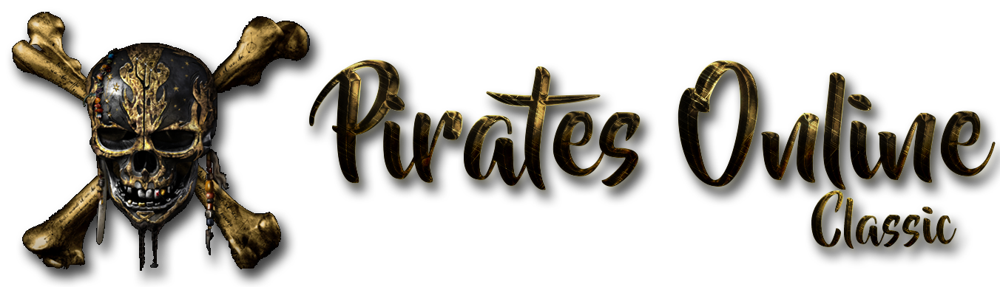

<p align="center">
  
</p>

<h1 align="center">Pirates Online Classic</h1>

<p align="center">
  A fan-made recreation of Disney's now-defunct MMORPG, Pirates of the Caribbean Online.
</p>

<p align="center">
  
  
  
</p>

---

## 📖 About

Pirates Online Classic is an open-source project dedicated to recreating the beloved Pirates of the Caribbean Online MMORPG that was shut down by Disney in 2013. Our goal is to bring back the nostalgic experience of sailing the Caribbean seas, engaging in ship battles, and exploring the pirate world.

This project is community-driven and welcomes contributions from developers of all skill levels!

## 📸 Screenshots

<p align="center">
  
</p>

<p align="center">
  
</p>

<p align="center">
  
</p>

---

## 🚀 Getting Started

### Prerequisites

Before you begin, ensure you have the following installed:

- **Python 3.11** - [Download Python](https://www.python.org/downloads/)
- **Git** - [Download Git](https://git-scm.com/downloads)
- **CMake** - Required for building Astron
- **A C++ Compiler** - GCC (Linux), Clang (macOS), or MSVC (Windows)

### Installation

#### 1. Clone the Repository

```bash
git clone https://github.com/PiratesOnlineClassic/pirates-online-classic.git
cd pirates-online-classic
```

#### 2. Install Python Dependencies

```bash
pip install -r requirements.txt
```

#### 3. Install Panda3D

This project works with the latest unmodified version of Panda3D. You can install it via pip:

```bash
pip install panda3d
```

Or build from source from the official repository: [https://github.com/panda3d/panda3d](https://github.com/panda3d/panda3d)

#### 4. Clone Game Resources

Clone the resources repository **next to** (not inside) the pirates-online-classic folder:

```bash
cd ..  # Go back to parent directory
git clone https://github.com/PiratesOnlineClassic/poc-resources.git resources
```

Your folder structure should look like this:

```
parent-folder/
├── pirates-online-classic/   # This repository
└── resources/                # Game resources (cloned above)
```

---

## 🔧 Building Astron

Astron is the distributed server architecture that powers Pirates Online Classic. We maintain a custom fork with modifications specific to our project.

### Clone the Astron Repository

```bash
git clone https://github.com/PiratesOnlineClassic/Astron.git
cd Astron
```

### Build on macOS

```bash
mkdir build && cd build
cmake ..
make -j$(sysctl -n hw.ncpu)
```

### Build on Linux

```bash
mkdir build && cd build
cmake ..
make -j$(nproc)
```

### Build on Windows

```powershell
mkdir build && cd build
cmake .. -G "Visual Studio 17 2022"
cmake --build . --config Release
```

### Post-Build

After building, copy the `astrond` executable to the `astron/` directory in this project:

```bash
# macOS/Linux
cp build/astrond ../pirates-online-classic/astron/

# Windows
copy build\Release\astrond.exe ..\pirates-online-classic\astron\
```

---

## 🎮 Running the Game

The servers must be started in a specific order. **UberDOG must be running before the AI server starts**, otherwise no shards will be detected.

### Startup Order

```
1. Astron (Message Director)
2. UberDOG (Global Services) ← Must be running before AI!
3. AI Server (Game World)
4. Client (Game)
```

### 1. Start Astron

First, start the Astron message director:

```bash
./start_astron
```

### 2. Start UberDOG

Next, start the UberDOG server. **This must be running before the AI server or shards won't be detected:**

```bash
./start_uberdog
```

### 3. Start the AI Server

Once UberDOG is running, start the AI server:

```bash
./start_ai
```

### 4. Launch the Client

Finally, open the game client:

```bash
./start_client
```

---

## 🤝 Contributing

We welcome contributions from everyone! Here's how you can help:

### How to Contribute

1. **Fork** the repository
2. **Create** a feature branch (`git checkout -b feature/amazing-feature`)
3. **Commit** your changes (`git commit -m 'Add some amazing feature'`)
4. **Push** to the branch (`git push origin feature/amazing-feature`)
5. **Open** a Pull Request

### Pull Request Process

All merges follow a three-step review process:

1. PR is submitted by the creator when changes are ready
2. PR is reviewed by a second contributor
3. PR is reviewed and merged by a third contributor

*For emergency/security fixes, only steps 1 and 2 are required.*

### Commit Guidelines

- **Be descriptive**: Use clear commit messages like `pirates/piratesbase: fix grammar issue with localizer`
- **Keep code clean**: Use spaces instead of tabs, remove extraneous whitespace
- **Add descriptions**: Include commit descriptions when applicable
- **Branch properly**: Create feature branches for substantial changes

### Code Guidelines

- **Do NOT** modify the client to benefit the server — we're creating a server for the client, not a client for the server
- **Retain originality**: Keep the codebase as close to the original as possible
- **No auto-formatters**: The codebase has been manually formatted; do not run autopep or similar tools
- **Don't remove "unnecessary" code**: If it isn't broken, don't fix it

---

## 🌿 Branch Structure

| Branch | Purpose |
|--------|---------|
| `master` | Stable release branch — no direct commits |
| `develop` | Active development, experimental changes, and new features |
| `qa` | Internal testing server for W.I.P features |
| `verify` | Client verification and bytecode matching work |

---

## 📁 Project Structure

```
pirates-online-classic/
├── astron/           # Astron server binaries and configuration
│   ├── config/       # Astron YAML configuration files
│   ├── databases/    # YAML database storage
│   └── dclass/       # Distributed class definitions
├── config/           # Game configuration files (.prc)
├── otp/              # Online Theme Park framework
├── pirates/          # Main game source code
├── libotp/           # OTP library bindings
├── libpirates/       # Pirates-specific library bindings
└── screenshots/      # Game screenshots
```

---

## 🧠 Server Architecture Deep Dive

This section provides an in-depth look at our reverse-engineered server architecture, covering the AI (Artificial Intelligence) server, UberDOG (global services), and the distributed object system.

### Overview: Three-Tier Architecture

Pirates Online Classic uses a distributed architecture consisting of three main server components:

```
┌─────────────────┐    ┌─────────────────┐    ┌─────────────────┐
│     Client      │◄──►│     Astron      │◄──►│   AI Server     │
│   (Panda3D)     │    │  (Message Dir)  │    │ (Game Logic)    │
└─────────────────┘    └────────┬────────┘    └─────────────────┘
                                │
                       ┌────────▼────────┐
                       │    UberDOG      │
                       │ (Global Svcs)   │
                       └─────────────────┘
```

1. **Astron** - Message Director and distributed object manager
2. **AI Server** - Game logic, world simulation, NPC behavior
3. **UberDOG (UD)** - Global services like authentication, friends, guilds

---

### AI Server (`pirates/ai/`)

The AI server is the heart of the game — it runs all authoritative game logic, world simulation, NPC behavior, combat resolution, and quest management. Each AI server instance represents one "shard" or "district" that players can join.

#### PiratesAIRepository

The main entry point for the AI server is `PiratesAIRepository`, which inherits from `PiratesInternalRepository`. This class orchestrates the entire game world.

```python
class PiratesAIRepository(PiratesInternalRepository):
    def __init__(self, baseChannel, serverId, districtName):
        # Initializes the zone allocator for dynamic zone management
        self.zoneAllocator = UniqueIdAllocator(
            PiratesGlobals.DynamicZonesBegin,
            PiratesGlobals.DynamicZonesEnd
        )
        self.zoneId2owner = {}  # Track zone ownership
        self.uidMgr = UniqueIdManager(self)  # Unique ID to doId mapping
```

**Key Responsibilities:**
- **Zone Allocation**: Dynamically allocates zones for instances, ships, and game areas using `UniqueIdAllocator`
- **Global Manager Creation**: Spawns all singleton manager objects on startup
- **World Creation**: Initializes the game world through `WorldCreatorAI`
- **Population Tracking**: Monitors shard population via `DistributedPopulationTrackerAI`
- **District Management**: Creates and manages the `PiratesDistrictAI` that represents this shard

#### Startup Sequence

The AI server follows a precise startup sequence:

```python
def handleConnected(self):
    # 1. Allocate our district channel
    self.districtId = self.allocateChannel()
    
    # 2. Create the district object (represents this shard)
    self.distributedDistrict = PiratesDistrictAI(self)
    self.distributedDistrict.setName(self.districtName)
    self.distributedDistrict.generateWithRequiredAndId(...)
    
    # 3. Create all global manager objects
    self.createGlobals()
    
    # 4. Load and spawn the game world
    self.createWorlds()
    
    # 5. Mark district as available for players
    self.distributedDistrict.b_setAvailable(1)
```

#### Global Managers Created

| Manager | Purpose |
|---------|---------|
| `TimeManagerAI` | Server time synchronization with clients |
| `FriendManagerAI` | Friend list operations and online status |
| `QuestManagerAI` | Quest state machines and progression |
| `BattleManagerAI` | Combat resolution, damage calculation, skill effects |
| `EnemySpawnerAI` | NPC spawning, respawning, and holiday-aware behavior |
| `ShipManagerAI` | Player and NPC ship management |
| `TeleportMgrAI` | Cross-instance and cross-shard teleportation |
| `TimeOfDayManagerAI` | Day/night cycle synchronization |
| `NewsManagerAI` | Holiday events and server announcements |
| `TradeManagerAI` | Player-to-player trading |
| `TutorialManagerAI` | Tutorial instance management |
| `WorldGridManagerAI` | Dynamic zone interest for players |
| `TargetManagerAI` | Combat targeting system |
| `BandManagerAI` | Crew/party system |
| `CrewMatchAI` | Crew matchmaking |
| `DiscordNotificationsAI` | Discord webhook integration |

#### Battle Manager

The `BattleManagerAI` handles all combat logic server-side:

```python
class BattleManagerAI(BattleManagerBase):
    def __init__(self, air):
        self._pendingSkillEffects = collections.deque()  # Effect queue
        
    def getTargetInRange(self, attacker, target, skillId, ammoSkillId):
        # Validates attack range before allowing damage
        attackRange = self.getModifiedAttackRange(attacker, skillId, ammoSkillId)
        distance = self.getRelativePosition(attacker, target)
        return distance <= attackRange
    
    def getTargetedSkillResult(self, avatar, target, skillId, ammoSkillId, ...):
        # Calculates damage, applies modifiers, handles crits
        # Returns skill result for client animation
```

**Combat Features:**
- Range validation between attacker and target
- Skill effect queuing with duration tracking
- Weapon ammo type detection (pistol, grenade, cannon, dagger)
- Combo diary tracking for skill chains

---

### UberDOG Server (`pirates/uberdog/`)

UberDOG (Uber Distributed Object Globals) handles all global services that persist across shards. There is typically only ONE UberDOG server for the entire game cluster.

#### PiratesUberRepository

```python
class PiratesUberRepository(PiratesInternalRepository):
    def handleConnected(self):
        # Create the root directory object
        rootObj = DistributedDirectoryAI(self)
        rootObj.generateWithRequiredAndId(self.getGameDoId(), 0, 0)
        
        # Start RPC server for external tools
        if config.GetBool('want-rpc-server', True):
            self.rpc = PiratesRPCServiceUD(self)
            self.rpc.start()
        
        self.createGlobals()
```

**Global Services:**

| Service | Description |
|---------|-------------|
| `ClientServicesManager` | Authentication, account creation, avatar management |
| `DistributedInventoryManager` | Persistent inventory storage across sessions |
| `DistributedShipLoader` | Ship data persistence and loading |
| `PCAvatarFriendsManager` | Cross-shard friend lists and online status |
| `PCGuildManager` | Guild creation, membership, and management |
| `DistributedTravelAgent` | Cross-shard teleportation routing |
| `CodeRedemption` | Promo code validation and rewards |
| `CentralLogger` | Centralized event logging |
| `PiratesSettingsMgr` | Server-wide configuration |
| `NewsManagerUD` | Server announcements and holiday sync |
| `DistrictTrackerUD` | Tracks all online shards |

#### Client Services Manager (CSM)

The CSM is the most complex UberDOG service — it handles the entire login and avatar selection flow using finite state machines:

```python
class LoginAccountFSM(OperationFSM):
    def enterStart(self, token):
        self.token = token
        self.demand('QueryAccountDB')
    
    def enterQueryAccountDB(self):
        self.csm.accountDB.lookup(self.token, self.__handleLookup)
    
    def __handleLookup(self, result):
        if self.accountId:
            self.demand('RetrieveAccount')
        else:
            self.demand('CreateAccount')
    
    def enterCreateAccount(self):
        self.account = {
            'ACCOUNT_AV_SET': [0] * 4,  # 4 avatar slots
            'CREATED': time.ctime(),
            'LAST_LOGIN': time.ctime(),
            'ACCESS_LEVEL': self.accessLevel
        }
        self.csm.air.dbInterface.createObject(...)
```

**Login Flow States:**
1. `Start` → Receives login token
2. `QueryAccountDB` → Validates credentials
3. `CreateAccount` OR `RetrieveAccount` → Gets/creates account
4. `StoreAccountID` → Links user ID to account
5. `SetAccount` → Finalizes login, sends avatar list

**Account Database Types:**

| Type | Use Case |
|------|----------|
| `DeveloperAccountDB` | Local dev (auto-creates accounts with access level 600) |
| `LocalAccountDB` | Persistent local accounts (first user gets 700, others 100) |
| `RemoteAccountDB` | Production with AES-128-CBC encrypted tokens |

#### Inventory Manager

The `DistributedInventoryManagerUD` handles all persistent inventory operations:

```python
class InventoryOperationFSM(FSM):
    TIMEOUT_SECONDS = 30.0  # All operations timeout after 30s
    
    def _finish(self, *args, **kwargs):
        # Guaranteed cleanup with timeout cancellation
        taskMgr.remove(self._timeoutTaskName)
        self.manager.avatar2fsm.pop(self.avatarId, None)
        if self.callback:
            self.callback(*args, **kwargs)
```

**Inventory FSM Types:**
- `QueryInventoryFSM` - Fetches inventory ID for an avatar
- `CreateInventoryFSM` - Creates new inventory in database
- `QueryShipInventoryFSM` - Ship-specific inventory queries
| `PCGuildManager` | Guild creation and management |
| `DistributedTravelAgent` | Cross-shard teleportation |
| `CodeRedemption` | Promo code redemption |

#### Client Services Manager (CSM)

The CSM handles the entire login flow:

1. **Account Lookup** - Validates credentials against the account database
2. **Account Creation** - Creates new accounts if needed
3. **Avatar Selection** - Loads pirate avatars for the account
4. **Avatar Creation** - Handles Make-A-Pirate flow
5. **Shard Selection** - Routes player to appropriate game server

**Account Database Types:**
- `DeveloperAccountDB` - For local development (auto-creates accounts)
- `LocalAccountDB` - Persistent local accounts
- `RemoteAccountDB` - Production with encrypted tokens

---

### World System (`pirates/world/`)

The world system manages all game areas, from the open ocean to island interiors.

#### World Hierarchy

```
DistributedMainWorldAI (piratesWorld)
├── DistributedOceanGridAI (Open Sea)
│   ├── DistributedIslandAI (Port Royal)
│   │   ├── DistributedGameAreaAI (Town Areas)
│   │   │   ├── DistributedGAInteriorAI (Buildings)
│   │   │   └── DistributedBuildingDoorAI (Doors)
│   │   └── DistributedShipDeployerAI
│   └── DistributedIslandAI (Tortuga)
│       └── ...
└── DistributedInstanceWorldAI (Instanced Content)
    └── DistributedPiratesTutorialWorldAI
```

#### WorldCreatorAI

The `WorldCreatorAI` is responsible for parsing world data files and instantiating game objects:

```python
class WorldCreatorAI(WorldCreatorBase, DirectObject):
    def __init__(self, air):
        # Managers for different object relationships
        self.linkManager = LinkManager(self.air)
        self.locatorManager = LocatorManager(self.air)
        self.connectorManager = ConnectorManager(self.air)
        self.movementLinkManager = MovementLinkManager(self.air)
        self.oceanAreaManager = OceanAreaManager(self.air)
```

**Key Managers:**
- **LinkManager** - Manages door/portal connections between areas
- **LocatorManager** - Tracks spawn points and object positions
- **ConnectorManager** - Handles area transitions (tunnels, doors)
- **MovementLinkManager** - AI pathing connections
- **OceanAreaManager** - Defines ocean spawn regions for ships

#### Cartesian Grid System

Both oceans and islands use a Cartesian grid for zone management:

```python
# Ocean Grid Configuration
OCEAN_GRID_SIZE = 60
OCEAN_CELL_SIZE = 2000
OCEAN_GRID_RADIUS = 3

# Island Grid Configuration  
ISLAND_GRID_SIZE = 20
ISLAND_CELL_SIZE = 75
ISLAND_GRID_RADIUS = 2
```

The grid system enables:
- **Interest Management** - Players only receive updates for nearby zones
- **Seamless Movement** - Zone transitions happen transparently
- **Scalable Visibility** - Reduces network traffic significantly

#### WorldGridManagerAI

Manages dynamic interest sets for avatars as they move through the world:

```python
class GridInterestHandler:
    def addInterestHandle(self, newZoneId):
        # Adds interest via CLIENTAGENT_ADD_INTEREST
        clientChannel = self.avatar.GetPuppetConnectionChannel(self.avatar.doId)
        self.air.clientAddInterest(clientChannel, context, parentDoId, zoneId)
```

---

### Instance System (`pirates/instance/`)

Instances are isolated world copies for instanced content like tutorials and treasure maps.

#### Instance Types

```python
INSTANCE_NONE = 0
INSTANCE_MAIN = 1      # Main world
INSTANCE_GENERIC = 2   # Generic instance
INSTANCE_PG = 3        # Poker Game
INSTANCE_TUTORIAL = 4  # Tutorial
```

#### DistributedInstanceBaseAI

Base class for all instance types:

```python
class DistributedInstanceBaseAI(DistributedObjectAI, WorldNodeAI):
    def __init__(self, air):
        self.spawnPts = {}  # Spawn point registry
        self.builder = ClientAreaBuilderAI(self.air, self)
    
    def addSpawnPt(self, area, spawnPt, index=None):
        # Registers spawn points for player respawning
        self.spawnPts[area] = self.spawnPts.setdefault(area, {})
        self.spawnPts[area][index or len(self.spawnPts[area])] = spawnPt
```

#### Travel Agent

The `DistributedTravelAgent` handles cross-shard teleportation:

1. AI requests teleport via `d_requestTeleportToShardAItoUD`
2. UD routes request to destination shard
3. Destination AI prepares spawn info
4. Client receives teleport initiation

---

### NPC & Enemy System

#### DistributedEnemySpawnerAI

Manages all NPC spawning with support for:

- **Townfolk** - Friendly NPCs for quests and shops
- **Skeletons** - Undead enemies
- **Navy Sailors** - British Navy enemies
- **Animals** - Wildlife (chickens, pigs, etc.)
- **Creatures** - Special enemies (crabs, bats, etc.)
- **Boss NPCs** - Elite enemies with special mechanics

```python
class SpawnNodeBase:
    def processDeath(self):
        # Schedules respawn after NPC death
        taskMgr.doMethodLater(5, self.__respawn, 'perform-respawn-%s' % self.objKey)
    
    def canRespawn(self):
        # Check for holiday requirements
        holidayName = self.objectData.get('Holiday', None)
        if holidayName:
            return self.air.newsManager.isHolidayActive(holidayId)
        return True
```

#### Holiday-Aware Spawning

NPCs can be configured to only spawn during specific holidays:
- Halloween skeletons
- Christmas decorations
- Special event bosses

---

### Ship System (`pirates/ship/`)

#### ShipManagerAI

Manages both player and NPC ships:

```python
class ShipManagerAI:
    def __init__(self, air):
        self.playerShips = set()
        self.npcShips = set()
        self.flagships = set()  # Boss ships
```

**Ship Types:**
- **Player Ships** - Owned by players, persistent
- **NPC Ships** - Navy, EITC, and Skeleton ships
- **Flagships** - Boss ships with special encounters

**NPC Ship Factions:**
- Navy (Ferret, Greyhound, Predator, Monarch, etc.)
- EITC (Sea Viper, Bloodhound, Corsair, Juggernaut, etc.)
- Undead (Phantom, Revenant, Storm Reaper, etc.)

#### Ship Deployer

Each island has a `DistributedShipDeployerAI` that handles:
- Player ship spawning when entering the ocean
- Spawn radius management around islands
- Ship-to-island proximity detection

---

### Quest System (`pirates/quest/`)

The quest system is one of the most valuable reverse-engineering discoveries in this project. **A significant amount of server-side AI logic was left in the original client's quest directory**, providing deep insight into how the game's quest system was designed.

#### QuestManagerAI

The quest system uses a FSM-based approach for managing quest state transitions:

```python
class QuestOperationFSM(FSM):
    def __init__(self, air, avatar, callback=None):
        self.air = air
        self.avatar = avatar
        self.callback = callback
```

#### QuestDB — The Goldmine

The `QuestDB.py` file contains **over 1,400 lines of quest definitions** that were originally server-side only. This includes:

- **Complete main story quests** (Chapters 1-3 with Jack Sparrow, Will Turner, Elizabeth, etc.)
- **NPC dialogue triggers** and cutscene sequences
- **Quest task definitions** (defeat enemies, recover items, visit locations)
- **Reward structures** (reputation, items, ships)
- **Quest prerequisites** and progression logic

```python
# Example quest definition from QuestDB
'c2_visit_will_turner': QuestDNA(
    tasks=VisitTaskDNA(npcId=NPCIds.WILL_TURNER, autoTriggerInfo=(AUTO_TRIGGER_OBJ_EXISTS, [NPCIds.WILL_TURNER])),
    instanceInfo=(INSTANCE_REF_TYPE_OBJECT, NPCIds.WILL_TURNER),
    finalizeInfo=({
        'type': 'cutscene',
        'giverId': NPCIds.WILL_TURNER,
        'sceneId': '2.1: Will Turner Sword',
        'preloadInfo': ['2.1.b: Sword Tut end']
    }, ...),
    questInt=2000,
    rewards=(ReputationReward(ExpRewards.TRIVIAL),),
    checkPoint=PiratesGlobals.TUT_GOT_CUTLASS
)
```

#### QuestLadderDB — Quest Chains

The `QuestLadderDB.py` defines quest progression trees with branching paths:

- **MainStory** - The core game storyline (Chapters 1-3)
- **Weapon Unlock Quests** - Dagger, Pistol, Cutlass, Voodoo Doll, Staff
- **Fortune Quests** - Side quests for treasure and items
- **Ship PVP Quests** - Spanish and French faction ship battles
- **Outfit Quests** - Basic, Intermediate, and Advanced clothing quests
- **Holiday Quests** - Father's Day 2008, special events

```python
# Quest ladder structure showing branching
FameQuestLadderDict = {
    'MainStory': QuestLadderDNA(
        name='MainStory',
        firstQuestId='Chapter1.rung1',
        containers=(
            QuestLadderDNA(name='Chapter 1', ...),
            QuestLadderDNA(name='Chapter 2', ...),
            QuestLadderDNA(name='Chapter 3', ...)  # Largest chapter with rum running, ship building
        )
    ),
    'WeaponDoll': QuestLadderDNA(...),   # Voodoo doll weapon quest
    'WeaponDagger': QuestLadderDNA(...), # Dagger unlock quest
    'WeaponGrenade': QuestLadderDNA(...),# Grenade quest
    ...
}
```

#### Quest Task Types

The quest system supports various task types defined in `QuestTaskDNA.py`:

| Task Type | Description |
|-----------|-------------|
| `VisitTaskDNA` | Visit a specific NPC or location |
| `DefeatTaskDNA` | Defeat a number of enemies of a type |
| `RecoverAvatarItemTaskDNA` | Loot items from enemies |
| `DeliverItemTaskDNA` | Deliver items to NPCs |
| `DeployShipTaskDNA` | Launch a ship from a dock |
| `CaptureTaskDNA` | Capture an enemy NPC |
| `MaroonTaskDNA` | Strand a captured NPC |
| `SinkShipTaskDNA` | Sink enemy ships |
| `PlayMinigameTaskDNA` | Play poker/blackjack |
| `BribeTaskDNA` | Bribe an NPC with gold |
| `SmuggleTaskDNA` | Smuggle cargo past enemies |

#### Quest Rewards

```python
# Reward types from QuestReward.py
ReputationReward(ExpRewards.TRIVIAL)  # XP rewards
ShipReward(1)                          # Ship unlocks
ItemReward(itemId, quantity)           # Inventory items
GoldReward(amount)                     # Currency
WeaponReward(weaponType)               # Weapon unlocks
```

#### Quest Indicators

The quest system includes sophisticated indicator nodes for guiding players:

- `QuestIndicatorNodeNPC` - Points to quest NPCs
- `QuestIndicatorNodeItem` - Points to collectible items
- `QuestIndicatorNodeShip` - Points to ships
- `QuestIndicatorNodeArea` - Points to areas/zones
- `QuestIndicatorNodeTunnel` - Points to area transitions

---

### Distributed Class System (DClass)

The `.dc` files define the network protocol for all distributed objects:

```
// otp.dc - Base OTP classes
// pirates.dc - Game-specific classes
```

Located in `astron/dclass/`, these files define:
- Field types and constraints
- RPC methods (client-to-server, server-to-client)
- RAM vs DB persistence
- Broadcast scope (owner, zone, shard)

---

### RPC System (`pirates/web/`)

The server exposes an RPC interface for external tools:

```python
@rpcservice(serviceName='cluster')
class ClusterService(RPCServiceUD):
    def systemMessage(self, message):
        """Broadcasts a message to all players"""
        self.air.systemMessage(message)
    
    def kickChannel(self, channel, reason=1, message=''):
        """Kicks users on a specific channel"""
        self.air.kickChannel(channel, reason, message)
```

---

## 💬 Community

Join our community to get help, share ideas, and connect with other contributors!

- Report bugs and request features through [GitHub Issues](https://github.com/PiratesOnlineClassic/pirates-online-classic/issues)
- Submit improvements through [Pull Requests](https://github.com/PiratesOnlineClassic/pirates-online-classic/pulls)

---

## ⚠️ Disclaimer

This is a non-commercial fan project created for educational and preservation purposes. Pirates of the Caribbean is a trademark of Disney. This project is not affiliated with, endorsed by, or connected to The Walt Disney Company in any way.
